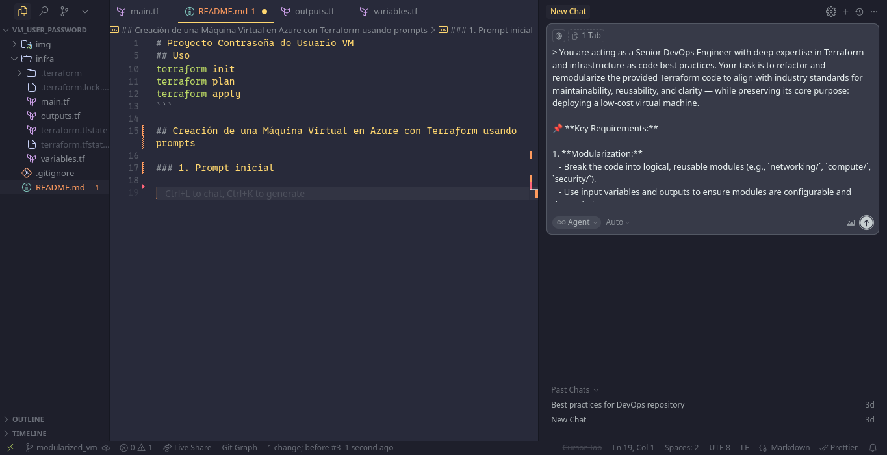
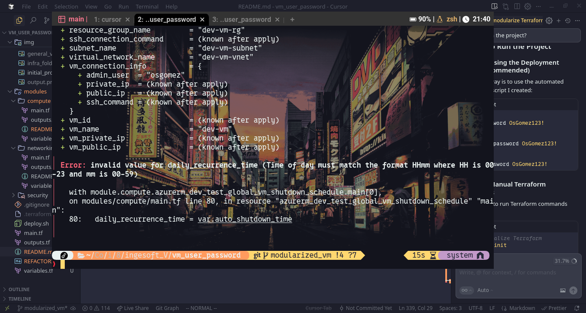
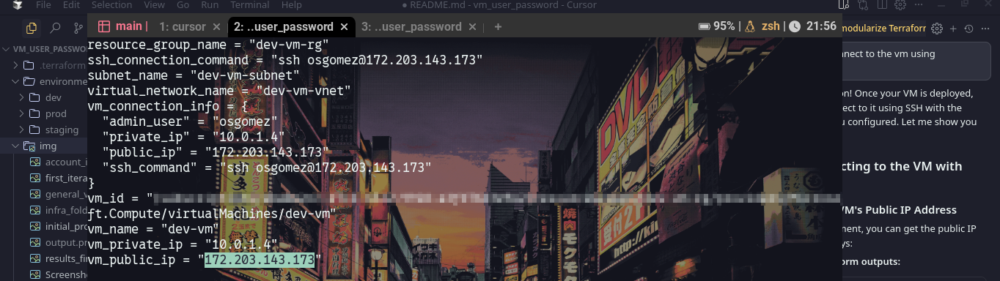
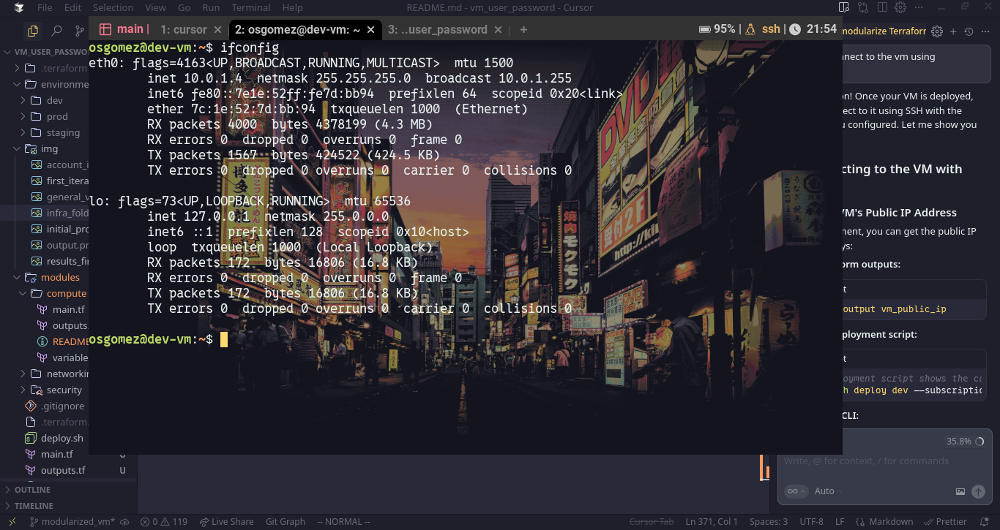

# Creacion de una maquina virtual modularizada con prompts

Prompt utilizado para la modularización y adopción de buenas prácticas de la vm.

---

> You are acting as a Senior DevOps Engineer with deep expertise in Terraform and infrastructure-as-code best practices. Your task is to refactor and remodularize the provided Terraform code to align with industry standards for maintainability, reusability, and clarity — while preserving its core purpose: deploying a low-cost virtual machine.

📌 **Key Requirements:**

1. **Modularization:**
   - Break the code into logical, reusable modules (e.g., `networking/`, `compute/`, `security/`).
   - Use input variables and outputs to ensure modules are configurable and decoupled.
   - Avoid hardcoded values — parameterize everything that may change across environments.

2. **Documentation:**
   - Add clear, concise README.md files for each module explaining its purpose, inputs, outputs, and usage examples.
   - Include inline comments in `.tf` files for non-obvious configurations.
   - Document any cost-saving decisions made (e.g., instance type, disk size, region selection).

3. **Cost Optimization:**
   - Preserve the “low-cost” objective — recommend the most economical but still viable instance types, storage, and regions.
   - Avoid unnecessary resources or over-provisioning.
   - If applicable, suggest spot instances, reserved instances, or auto-shutdown policies (if supported by provider).

4. **Best Practices:**
   - Follow Terraform style guide (naming conventions, resource grouping, etc.).
   - Use `terraform fmt`, validate with `terraform validate`.
   - Structure for multi-environment support (dev/staging/prod) using workspaces or separate variable files.

5. **Output Format:**
   - Return the full refactored code in a well-organized directory structure (e.g., using tree format).
   - Include a top-level `main.tf`, `variables.tf`, `outputs.tf`, and module calls.
   - Explain key changes and rationale behind modularization decisions.

✅ Your goal: Deliver production-grade, readable, scalable, and cost-conscious Terraform code that any engineer can understand, extend, and deploy with confidence.

---



# **Resultado de la operación**:

## Azure VM Infrastructure with Terraform

This project provides a production-grade, modularized Terraform configuration for deploying cost-optimized Azure virtual machines with proper security, networking, and monitoring capabilities.

## 🏗️ Architecture Overview

The infrastructure is organized into three main modules:

- **Networking Module** (`modules/networking/`): VNet, subnet, and public IP resources
- **Security Module** (`modules/security/`): Network Security Groups and security rules
- **Compute Module** (`modules/compute/`): Virtual machines, network interfaces, and storage

## 📁 Project Structure

```
vm_user_password/
├── main.tf                          # Root configuration
├── variables.tf                     # Root variables
├── outputs.tf                       # Root outputs
├── README.md                        # This file
├── modules/
│   ├── networking/                  # Networking module
│   │   ├── main.tf
│   │   ├── variables.tf
│   │   ├── outputs.tf
│   │   └── README.md
│   ├── security/                    # Security module
│   │   ├── main.tf
│   │   ├── variables.tf
│   │   ├── outputs.tf
│   │   └── README.md
│   └── compute/                     # Compute module
│       ├── main.tf
│       ├── variables.tf
│       ├── outputs.tf
│       └── README.md
└── environments/                    # Environment-specific configurations
    ├── dev/
    │   └── terraform.tfvars
    ├── staging/
    │   └── terraform.tfvars
    └── prod/
        └── terraform.tfvars
```

## 🚀 Quick Start

### Prerequisites

- [Terraform](https://www.terraform.io/downloads.html) >= 1.0
- [Azure CLI](https://docs.microsoft.com/en-us/cli/azure/install-azure-cli) installed and configured
- Azure subscription with appropriate permissions

### 1. Authentication

```bash
# Login to Azure
az login

# Set your subscription
az account set --subscription "your-subscription-id"
```

### 2. Basic Deployment

```bash
# Initialize Terraform
terraform init

# Plan the deployment
terraform plan -var="subscription_id=your-subscription-id" -var="admin_password=YourSecurePassword123!"

# Apply the configuration
terraform apply -var="subscription_id=your-subscription-id" -var="admin_password=YourSecurePassword123!"
```

### 3. Environment-Specific Deployment

```bash
# Development environment
terraform plan -var-file="environments/dev/terraform.tfvars" -var="subscription_id=your-subscription-id" -var="admin_password=YourSecurePassword123!"
terraform apply -var-file="environments/dev/terraform.tfvars" -var="subscription_id=your-subscription-id" -var="admin_password=YourSecurePassword123!"

# Staging environment
terraform plan -var-file="environments/staging/terraform.tfvars" -var="subscription_id=your-subscription-id" -var="admin_password=YourSecurePassword123!"
terraform apply -var-file="environments/staging/terraform.tfvars" -var="subscription_id=your-subscription-id" -var="admin_password=YourSecurePassword123!"

# Production environment
terraform plan -var-file="environments/prod/terraform.tfvars" -var="subscription_id=your-subscription-id" -var="admin_password=YourSecurePassword123!"
terraform apply -var-file="environments/prod/terraform.tfvars" -var="subscription_id=your-subscription-id" -var="admin_password=YourSecurePassword123!"
```

## 💰 Cost Optimization Features

### VM Configuration
- **Standard_B1ls**: Burstable performance, 1 vCPU, 0.5 GB RAM - Most cost-effective for light workloads
- **Standard_B1s**: Alternative with 1 vCPU, 1 GB RAM for slightly more demanding workloads

### Storage Optimization
- **Standard_LRS**: Lowest cost storage option for development
- **StandardSSD_LRS**: Better performance for production workloads
- **30-100 GB Disks**: Right-sized for different environments

### Auto-shutdown
- **Automatic Shutdown**: Prevents unnecessary costs during non-business hours
- **Configurable Time**: Set shutdown time based on usage patterns
- **Environment-Specific**: Different shutdown times for dev/staging/prod

### Cost Estimates (Monthly)
- **Development**: ~$8-12/month (with auto-shutdown)
- **Staging**: ~$12-18/month (with auto-shutdown)
- **Production**: ~$18-25/month (24/7 operation)

## 🔒 Security Features

### Network Security
- **Network Security Groups**: Configurable firewall rules
- **SSH Access Control**: Restrict SSH access by IP range
- **HTTP/HTTPS Control**: Optional web access configuration

### Authentication Options
- **Password Authentication**: Simple setup for development
- **SSH Key Authentication**: More secure for production
- **Mixed Authentication**: Support for both methods

### Security Best Practices
- **Principle of Least Privilege**: Only necessary ports and protocols
- **IP Restrictions**: Limit access to specific IP ranges
- **Regular Updates**: Keep OS and applications updated

## 🏢 Multi-Environment Support

### Development Environment
- **Open Security**: Permissive firewall rules for development
- **Cost Optimized**: Smallest VM size, auto-shutdown enabled
- **Quick Setup**: Minimal configuration required

### Staging Environment
- **Balanced Security**: Moderate restrictions with testing capabilities
- **Performance Testing**: Slightly larger VM for testing
- **Auto-shutdown**: Extended hours for testing

### Production Environment
- **Maximum Security**: Restrictive firewall rules, IP restrictions
- **Performance Optimized**: Better storage and compute resources
- **24/7 Operation**: No auto-shutdown for production workloads

## 📊 Monitoring and Management

### Resource Tagging
All resources are tagged with:
- **Environment**: dev/staging/prod
- **Project**: Project identifier
- **ManagedBy**: Terraform
- **CostCenter**: For cost tracking
- **Owner**: Team responsible

### Outputs
The configuration provides comprehensive outputs:
- VM connection information
- Network details
- Security group information
- Cost optimization status

## 🔧 Customization

### Adding Custom Security Rules
```hcl
custom_security_rules = [
  {
    name                       = "CustomPort"
    priority                   = 2000
    direction                  = "Inbound"
    access                     = "Allow"
    protocol                   = "Tcp"
    source_port_range          = "*"
    destination_port_range     = "8080"
    source_address_prefix      = "10.0.0.0/8"
    destination_address_prefix = "*"
    description                = "Allow custom port 8080 from internal networks"
  }
]
```

### Using SSH Keys
```hcl
disable_password_authentication = true
ssh_public_key = "ssh-rsa AAAAB3NzaC1yc2EAAAADAQABAAABgQC..."
```

### Custom VM Images
```hcl
image_publisher = "Canonical"
image_offer     = "UbuntuServer"
image_sku       = "20.04-LTS"
image_version   = "latest"
```

## 🧪 Testing and Validation

### Terraform Validation
```bash
# Format code
terraform fmt -recursive

# Validate configuration
terraform validate

# Plan without applying
terraform plan
```

### Security Testing
- Test SSH access from allowed IP ranges
- Verify firewall rules are working correctly
- Test auto-shutdown functionality

## 📚 Module Documentation

Each module includes comprehensive documentation:
- [Networking Module](modules/networking/README.md)
- [Security Module](modules/security/README.md)
- [Compute Module](modules/compute/README.md)

## 🚨 Troubleshooting

### Common Issues

1. **Authentication Errors**
   - Verify Azure CLI login: `az account show`
   - Check subscription ID is correct
   - Ensure proper permissions

2. **Resource Naming Conflicts**
   - Use unique name_prefix values
   - Check for existing resources in Azure

3. **Network Connectivity Issues**
   - Verify security group rules
   - Check IP address restrictions
   - Test from allowed IP ranges

### Getting Help

- Check Terraform logs: `TF_LOG=DEBUG terraform apply`
- Review Azure portal for resource status
- Validate network connectivity: `ping <public-ip>`

## 🔄 Maintenance

### Regular Tasks
- Update Terraform and provider versions
- Review and update security rules
- Monitor costs and optimize resources
- Apply OS and application updates

### Backup Strategy
- Consider implementing automated backups
- Use Azure Backup for VM snapshots
- Document recovery procedures

## 📈 Scaling

### Horizontal Scaling
- Use this configuration as a template
- Deploy multiple VMs with different configurations
- Consider using Azure Virtual Machine Scale Sets

### Vertical Scaling
- Increase VM size as needed
- Upgrade storage types for better performance
- Add additional network interfaces

## 🤝 Contributing

1. Fork the repository
2. Create a feature branch
3. Make your changes
4. Test thoroughly
5. Submit a pull request

## 📄 License

This project is licensed under the MIT License - see the LICENSE file for details.

## 🙏 Acknowledgments

- Azure Terraform Provider team
- Terraform community
- Azure documentation team

---

**Note**: This configuration is designed for cost optimization while maintaining security and functionality. Always review and customize security settings for your specific requirements.

# Resultados reales al correr el código



# Segunda iteracion

Prompt usado:
I am having this error:
│ Error: invalid value for daily_recurrence_time (Time of day must match the format HHmm where HH is 00-23 and mm is 00-59)
│
│   with module.compute.azurerm_dev_test_global_vm_shutdown_schedule.main[0],
│   on modules/compute/main.tf line 80, in resource "azurerm_dev_test_global_vm_shutdown_schedule" "main":
│   80:   daily_recurrence_time = var.auto_shutdown_time

While performing this command:
bash ./deploy.sh deploy dev --subscription-id eba0e2cc-47c4-4522-9928-a3f676b3e9e2 --admin-password OsGomez123!

Can you fix it?

---

# Resultados


## Before (causing error):
daily_recurrence_time = var.auto_shutdown_time

## After (fixed):
daily_recurrence_time = replace(var.auto_shutdown_time, ":", "")




