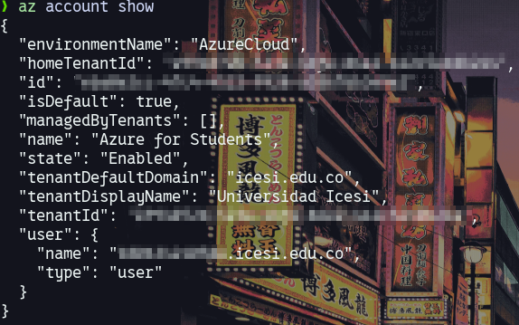
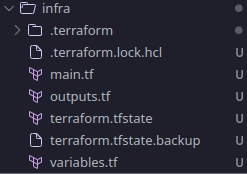
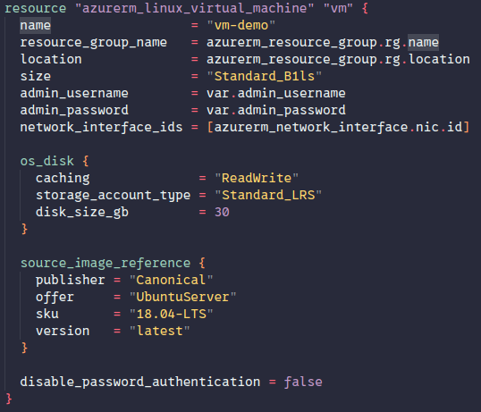
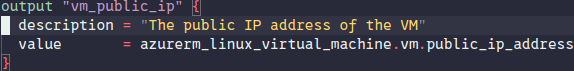

# Proyecto Contraseña de Usuario VM

Este proyecto usa terraform para desplegar una máquina virtual con terraform en azure.

## Uso

Hacer el despliegue con:

```bash
terraform init
terraform plan
terraform apply
```

## Creación de una Máquina Virtual en Azure con Terraform

### 1. Preparar el entorno

Se hizo la verificación para encontrar el id de la cuenta:


```sh
az account show
```

### 2. Estructura de archivos

- Se creó una carpeta `infra/` y dentro de ella los archivos:
  - `main.tf`: Definición de recursos (grupo, red, VM, IP, NSG, etc.)
  - `variables.tf`: Variables para usuario y contraseña.
  - `outputs.tf`: Salida con la IP pública de la VM.



### 3. Definir los recursos en Terraform

- Se configuró el proveedor de Azure.
- Se creó un grupo de recursos, red virtual, subred, interfaz de red y una máquina virtual Linux (Ubuntu) con el tamaño más económico (`Standard_B1ls`).
- Se habilitó la autenticación por usuario y contraseña.
- Se agregó una IP pública con SKU `Standard` y método de asignación `Static`.
- Se creó un Network Security Group (NSG) y una regla para permitir acceso SSH (puerto 22).
- Se asoció el NSG a la interfaz de red de la VM. (Sin esto no sería posible la conexión con la vm por políticas de Azure)



### 4. Inicializar y aplicar Terraform

Desde la carpeta `infra/` se ejecutó:

```sh
terraform init
terraform plan
terraform apply
```

### 5. Obtener la IP pública

- Al finalizar, Terraform mostró la IP pública asignada a la VM tal y como fue asignado en las variables de output.



### 6. Conectarse a la VM

- Se usa el comando para conectarse a la vm usando ssh pero con contraseña.

```sh
ssh <usuario>@<ip_publica>
```

Ejemplo:

```sh
ssh osgomez@4.227.235.237
```
